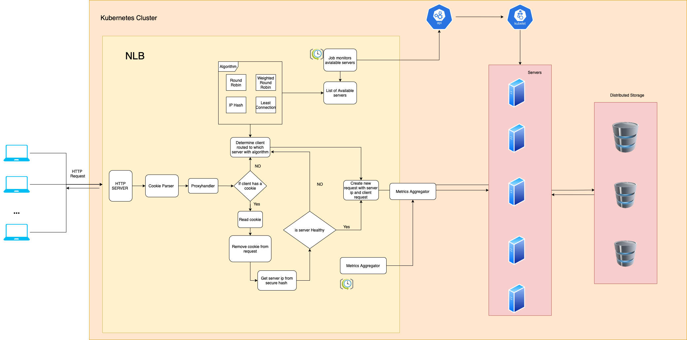

# Network Load Balancer

Implementation of Network Load balancer using Golang . The infrastructure is created using Helm, kubernetes and docker & The load on the NLB is simulated using Go concurrency. 

## Architecture



## Getting Started

### Dependencies

* Go 1.19.2
* Kubernetes 
* Docker
* Helm 3.10.0 

### Installing
Build 
```
make build &&  make docker 
```

deploy 
```
make helm
```

Running Client Application  
```
go run client/main.go
```

### [Results and analysis](nlb.ipynb)

## Authors
- Niraj Gupta
- Angel Dong 
- Huilin Han 
- Adam Hayes 